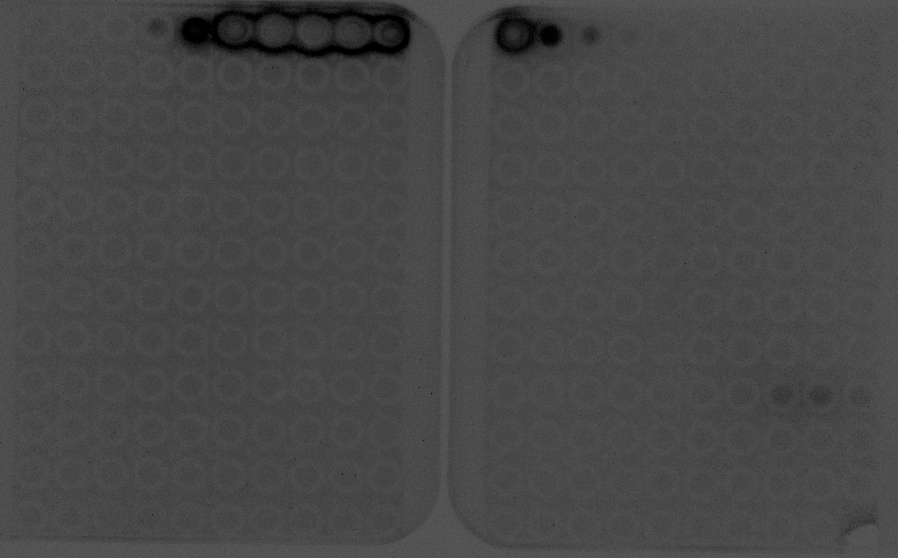
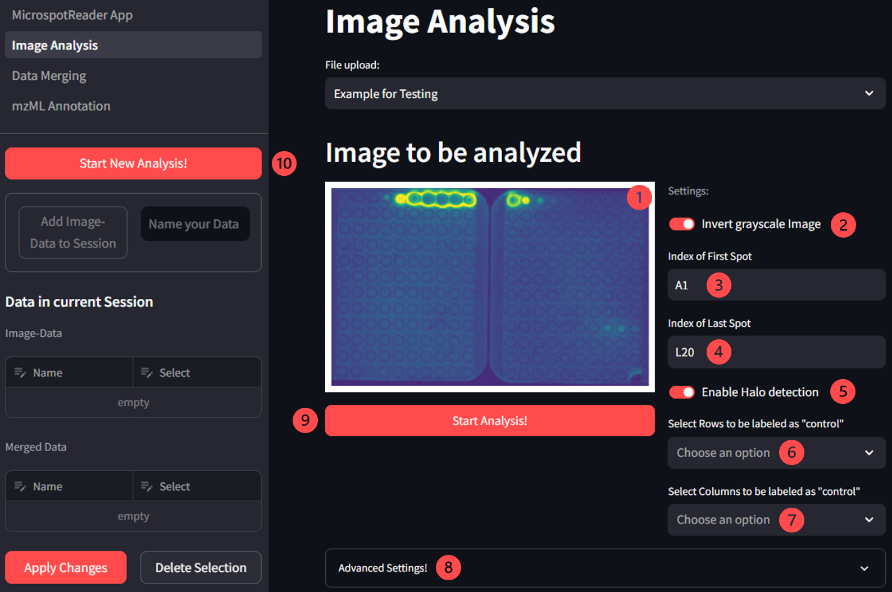
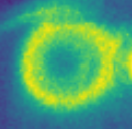
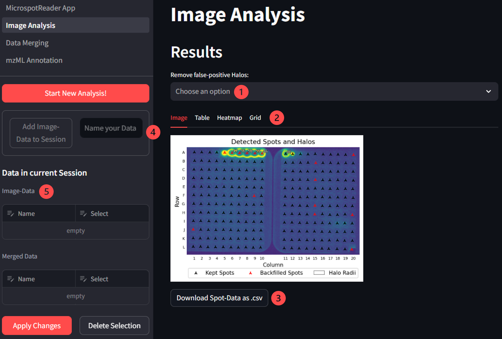
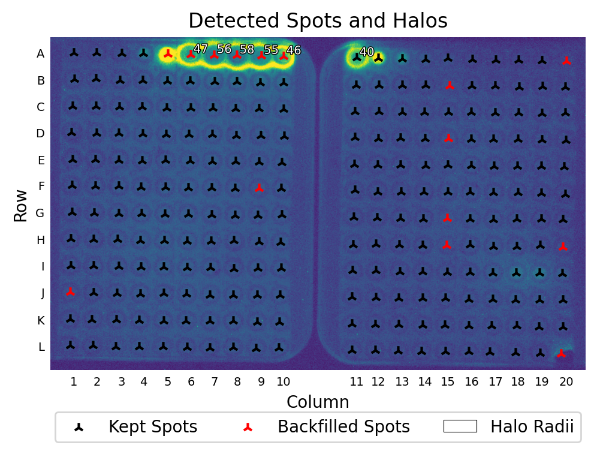
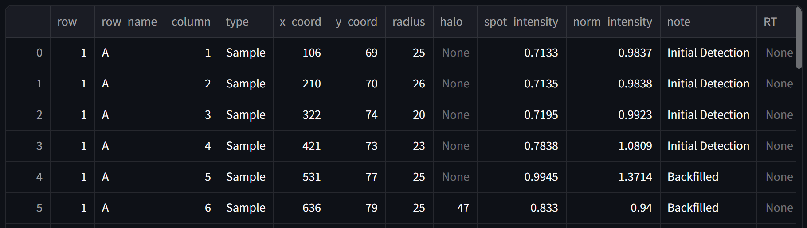

# User Guide for the MicrospotReader Web App

This document is directed at new users of the Web App implementation of the MicrospotReader Workflow. It will guide you through the individual steps required for annotation of LC-MS data with concomitantly determined bioactivity-values.

## Purpose

WIP

## Limitations

WIP

## Image Analysis

The Image Analysis page is responsible for extracting all required information from the performed optical bioactivity assay. It is important that the format of the recorded images is correct in order to yield a sucessful analysis.

### The Image

The image processing algorithm relies on a regular spacing of clearly visible spots or circular objects. Therefore images __must__ contain a regular grid of spots. As long as most spots within the image are clearly visible, artefacts from the inital detection can be corrected for. However, if noise within the image leads to a significant number of spots not being distinguishable from the background, entire rows or columns of spots might accidently be ignored. 

Ideally the images should be cropped such that they only contain the microPAD assay and nothing more. This should be done to avoid any artefacts during image processing. Aligning the microPAD assay with the image axes will also lead to more precise results and faster processing as the grid parameters (more on that soon) can be restricted more strongly.

Currently allowed image file formats include .tif, .png and .jpg as these have been tested so far. Allowed color spaces are RGB and grayscale. Since the image can be inverted in the Web App, it is not important whether the pixel intensity decreases or increases with the assays signal intensity.

An example of a reasonable image for analysis is shown here:

### General Layout and Workflow

#### General Settings

After uploading the image to be analyzed you will see the following set-up: 

1. __The uploaded image:__ Version of the image to be used for densitometric analysis. Might be inverted if Nr. 2 is turned on.
2. __Invert grayscale image:__ Inverts the values of the grayscale image if turned on
3. __Index of the first spot:__ Corresponds to the top-left spot. Letter corresponds to row, number corresponds to column. Input is required!
4. __Index of the last spot:__ Corresponds to the bottom-right spot. Letter corresponds to row, number corresponds to column. Input is required!
5. __Enable halo detection:__ If turned on, will check each spot for an antimicrobial halo. Only enable, if a reporterstrain assay is performed in which halos are to be expected!
6. __Select Rows to be labeled as "control":__ Row-indices of entire rows used as negative control for normalization. Not required!
7. __Select Columns to be labeled as "control":__ Column-indices of entire columnes used as negative control for normalization. Not required!
8. __Advanced Settings:__ Contains tunable settings for all parameters needed during image analysis. Change with caution!
9. __Start Analysis Button:__ Starts the image analysis. The settings will disappear after pressing this button!
10. __Start New Analysis Button:__ Resets the current analysis so that a new one may be performed.

> Once all of the Settings have been set appropriately, the user can then press the ___Start Analysis!___ button in order to start the image processing workflow.

In order to start the Analysis only three inputs are actually required: The image (1) and the indices of the first and last spots (3 and 4). All other settings are optional. The indices are relevant for two reasons:

1. If multiple images contain information on the same assay, the correct indices are required for merging of the data tables.
2. The number of spots in the image is calculated based on the indices. This is relevant for the initial detection of spots in the image.

If atleast one row or column is selected as a control (7 and 7), all spots will be normalized based on the values of the selected spots. This is done to ensure consistent results between different images. The resulting heatmap will then display the normalized values instead the values are then also shown in the column ___"norm_intensity"___ in the data table. More on that later.

#### Anti-microbial Halos

The halo detection setting is only relevant for assays in which anti-microbial halos are expected. For spots surrounded by a halo, evaluation of the spot intensites does not yield sensible results as the reporter strain died off in these regions. Instead here, the size of the halo correlates with the activity of the tested fraction. Therefore if halo detection is turned on an additional step is performed in which the radius of all present halos is determined in pixels. 

 _Close-up of an anti-microbial Halo_

Since the radius of halos and spot-intensity are non compatible values that both correlate to the activity of the eluted fraction, they have to be scaled to each other. For now the scaling factor can be chosen arbitrarily to allow for qualitate scaling. In the future however we will implement a system for scaling based on measured data, hoping that this will lead to more quantitative results.

In reporter strain assays the intensity of signals might vary alot depending on how well the bacterial culture grew. This is not true for the size of a halo. The radius within which an antimicrobial substance is lethal to the reporter strain does not change significantly with the concentration of cells in the agar. Therefore the scaling of halos to spot intensities is done only for normalized data by default(this can be changed in the advanced settings however). For spots surrounded by a halo, the results will then show the scaled version of the halo radius instead of the normalized intensity in the column ___"norm_intensity"___ in the data table (as well as the heatmap).

#### Display of Results

After image analysis has been concluded the following set-up will be shown:

1. __Remove false-positive Halos:__ Remove falsely detected halos from spots using their index.
2. __Tabs Displaying all Results:__ Tabs showing the relevant results from image analysis in tabular and visual form.
3. __Download Button:__ Download the resulting table as a .csv file.
4. __Store Data in the current session:__ For further processing of the data without the need to upload the resulting .csv files for every step, the data can be given a name and stored in the current session.
5. __Display of all stored image datasets:__ Displays the name of all datasets that have been stored in the session. The name of each dataset can be changed at any time. By selecting a dataset and clicking the button ___Delete Selection___, data can be removed from the session.

> Once all data has been downloaded and/or added to the session, one can continue to the next step: __Data Merging__

#### The Resulting Image

The first tab of the _Results-View_ shows the analyzed image overlayed with some of the extracted information:

There are four important things shown in the image:
1. All spots detected during initial spot detection (shown in black)
2. All spots backfilled during spot correction (shown in red)
3. The radii of all spots surrounded by an anti-microbial halo (if any are present and halo detection was enabled)
4. The row and column indices of the spot-grid.

This view allows the user to check for any mistakes made during image analysis, like missing rows or columns, correct detection of all spots, correct row and column indexing and correct assignment of anti-microbial halos.

If a halo has been wrongfully assigned to a spot, it can be removed manually by using the drop-down menu above the image. Reasons for mistakes during spot-detection will be discussed later. 

#### The Data Table

The second tab of the _Results-View_ shows the resulting data in tabular form and can be downloaded as a .csv file. An example is shown here:

Currently the data table contains 13 rows:
1. __[Unnamed]__: Shows the row-index of the __table__.
2. __[row]__: Shows the numeric index of the row a specific spot belongs to.
3. __[row_name]__: Shows the alphabetic index of the row a sepecific spot belongs to.
4. __[column]__: Shows the numeric index of the column a specific spot belongs to.
5. __[type]__: Shows the type of the spot, currently either "Sample" for samples or "Control" for control-type spots. 
6. __[x_coord]__: Shows the x-coordinate of the center of a spot.
7. __[y_coord]__: Shows the y-coordinate of the center of a spot. Note that for images, the higher the y-value, the lowerthe spot is in the image.
8. __[radius]__: Shows the radius of the detected spot in pixels.
9. __[halo]__: Shows the radius of the halo surrounding a particular spot in pixels. If no halo was detected, this field is empty.
10. __[spot_intensity]__: Shows the mean intensity of pixels within the spot. This value is not normalized and if not changed in the advanced settings, does not contain a scaled version of the halo-radius if a halo is present.
11. __[norm_intensity]__: Shows the spot intensity normalized to values of spots of type "Control". If a halo is present and the advanced settings have not been changed, Shows a scaled version of the halo-radius. If no spots of type "Control" exist, this column will be left empty.
12. __[note]__: Shows at which stage a particular spot was detected. Currently either "Initial Detection" if a spot was detected during initial spot detection or "Backfilled" if a spot was backfilled during spot-correction.
13. __[RT]__: Shows the retention time of the fraction eluted to that spot. The RT is added during Data-Merging, therefore this column is empty at this stage.

#### The Heatmap

The third tab of the _Results-View_ shows a heatmap of spot-intensities. 

## Data Merging and Manipulation

## Annotation of .mzML-Files