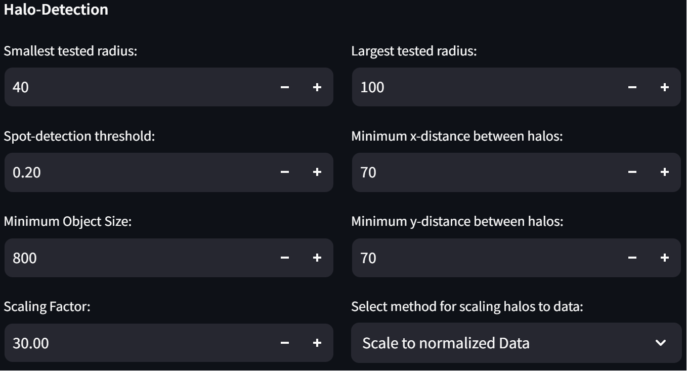

# User Guide for the MicrospotReader Web App

This document is directed at new users of the Web App implementation of the MicrospotReader Workflow. It will guide you through the individual steps required for annotation of LC-MS data with concomitantly determined bioactivity-values.

## The microPAD

WIP

## Purpose

WIP

## Limitations

WIP

## Image Analysis

The Image Analysis page is responsible for extracting all required information from the performed optical bioactivity assay. It is important that the format of the recorded images is correct in order to yield a sucessful analysis.

### The Image

The image processing algorithm relies on a regular spacing of clearly visible spots or circular objects. Therefore images __must__ contain a regular grid of spots. As long as most spots within the image are clearly visible, artefacts from the inital detection can be corrected for. However, if noise within the image leads to a significant number of spots not being distinguishable from the background, entire rows or columns of spots might accidently be ignored. 

Ideally the images should be cropped such that they only contain the microPAD assay and nothing more. This should be done to avoid any artefacts during image processing. Aligning the microPAD assay with the image axes will also lead to more precise results and faster processing as the grid parameters (more on that soon) can be restricted more strongly.

Currently allowed image file formats include .tif, .png and .jpg as these have been tested so far. Allowed color spaces are RGB and grayscale. Since the image can be inverted in the Web App, it is not important whether the pixel intensity decreases or increases with the assays signal intensity.

An example of a reasonable image for analysis is shown here:

### General Layout and Workflow

#### General Settings

After uploading the image to be analyzed you will see the following set-up: 

1. __The uploaded image:__ Version of the image to be used for densitometric analysis. Might be inverted if Nr. 2 is turned on.
2. __Invert grayscale image:__ Inverts the values of the grayscale image if turned on
3. __Index of the first spot:__ Corresponds to the top-left spot. Letter corresponds to row, number corresponds to column. Input is required!
4. __Index of the last spot:__ Corresponds to the bottom-right spot. Letter corresponds to row, number corresponds to column. Input is required!
5. __Enable halo detection:__ If turned on, will check each spot for an antimicrobial halo. Only enable, if a reporterstrain assay is performed in which halos are to be expected!
6. __Select Rows to be labeled as "control":__ Row-indices of entire rows used as negative control for normalization. Not required!
7. __Select Columns to be labeled as "control":__ Column-indices of entire columnes used as negative control for normalization. Not required!
8. __Advanced Settings:__ Contains tunable settings for all parameters needed during image analysis. Change with caution!
9. __Start Analysis Button:__ Starts the image analysis. The settings will disappear after pressing this button!
10. __Start New Analysis Button:__ Resets the current analysis so that a new one may be performed.

> Once all of the Settings have been set appropriately, the user can then press the ___Start Analysis!___ button in order to start the image processing workflow.

In order to start the Analysis only three inputs are actually required: The image (1) and the indices of the first and last spots (3 and 4). All other settings are optional. The indices are relevant for two reasons:

1. If multiple images contain information on the same assay, the correct indices are required for merging of the data tables.
2. The number of spots in the image is calculated based on the indices. This is relevant for the initial detection of spots in the image.

If atleast one row or column is selected as a control (7 and 7), all spots will be normalized based on the values of the selected spots. This is done to ensure consistent results between different images. The resulting heatmap will then display the normalized values instead the values are then also shown in the column ___"norm_intensity"___ in the data table. More on that later.

#### Anti-microbial Halos

The halo detection setting is only relevant for assays in which anti-microbial halos are expected. For spots surrounded by a halo, evaluation of the spot intensites does not yield sensible results as the reporter strain died off in these regions. Instead here, the size of the halo correlates with the activity of the tested fraction. Therefore if halo detection is turned on an additional step is performed in which the radius of all present halos is determined in pixels. 

 _Close-up of an anti-microbial Halo_

Since the radius of halos and spot-intensity are non compatible values that both correlate to the activity of the eluted fraction, they have to be scaled to each other. For now the scaling factor can be chosen arbitrarily to allow for qualitate scaling. In the future however we will implement a system for scaling based on measured data, hoping that this will lead to more quantitative results.

In reporter strain assays the intensity of signals might vary alot depending on how well the bacterial culture grew. This is not true for the size of a halo. The radius within which an antimicrobial substance is lethal to the reporter strain does not change significantly with the concentration of cells in the agar. Therefore the scaling of halos to spot intensities is done only for normalized data by default(this can be changed in the advanced settings however). For spots surrounded by a halo, the results will then show the scaled version of the halo radius instead of the normalized intensity in the column ___"norm_intensity"___ in the data table (as well as the heatmap).

#### Display of Results

After image analysis has been concluded the following set-up will be shown:

1. __Remove false-positive Halos:__ Remove falsely detected halos from spots using their index.
2. __Tabs Displaying all Results:__ Tabs showing the relevant results from image analysis in tabular and visual form.
3. __Download Button:__ Download the resulting table as a .csv file.
4. __Store Data in the current session:__ For further processing of the data without the need to upload the resulting .csv files for every step, the data can be given a name and stored in the current session.
5. __Display of all stored image datasets:__ Displays the name of all datasets that have been stored in the session. The name of each dataset can be changed at any time. By selecting a dataset and clicking the button ___Delete Selection___, data can be removed from the session.

> Once all data has been downloaded and/or added to the session, one can continue to the next step: __Data Merging__

#### The Resulting Image

The first tab of the _Results-View_ shows the analyzed image overlayed with some of the extracted information:

There are four important things shown in the image:
1. All spots detected during initial spot detection (shown in black)
2. All spots backfilled during spot correction (shown in red)
3. The radii of all spots surrounded by an anti-microbial halo (if any are present and halo detection was enabled)
4. The row and column indices of the spot-grid.

This view allows the user to check for any mistakes made during image analysis, like missing rows or columns, correct detection of all spots, correct row and column indexing and correct assignment of anti-microbial halos.

If a halo has been wrongfully assigned to a spot, it can be removed manually by using the drop-down menu above the image. Reasons for mistakes during spot-detection will be discussed later. 

#### The Data Table

The second tab of the _Results-View_ shows the resulting data in tabular form and can be downloaded as a .csv file. An example is shown here:

Currently the data table contains 13 rows:
1. __[Unnamed]__: Shows the row-index of the __table__.
2. __[row]__: Shows the numeric index of the row a specific spot belongs to.
3. __[row_name]__: Shows the alphabetic index of the row a sepecific spot belongs to.
4. __[column]__: Shows the numeric index of the column a specific spot belongs to.
5. __[type]__: Shows the type of the spot, currently either "Sample" for samples or "Control" for control-type spots. 
6. __[x_coord]__: Shows the x-coordinate of the center of a spot.
7. __[y_coord]__: Shows the y-coordinate of the center of a spot. Note that for images, the higher the y-value, the lowerthe spot is in the image.
8. __[radius]__: Shows the radius of the detected spot in pixels.
9. __[halo]__: Shows the radius of the halo surrounding a particular spot in pixels. If no halo was detected, this field is empty.
10. __[spot_intensity]__: Shows the mean intensity of pixels within the spot. This value is not normalized and if not changed in the advanced settings, does not contain a scaled version of the halo-radius if a halo is present.
11. __[norm_intensity]__: Shows the spot intensity normalized to values of spots of type "Control". If a halo is present and the advanced settings have not been changed, Shows a scaled version of the halo-radius. If no spots of type "Control" exist, this column will be left empty.
12. __[note]__: Shows at which stage a particular spot was detected. Currently either "Initial Detection" if a spot was detected during initial spot detection or "Backfilled" if a spot was backfilled during spot-correction.
13. __[RT]__: Shows the retention time of the fraction eluted to that spot. The RT is added during Data-Merging, therefore this column is empty at this stage.

#### The Heatmap

The third tab of the _Results-View_ shows a heatmap of spot-intensities. If normalization was possible, the heatmap will show the normalized values. In case halos were detected, spots with a surrounding halo are marked with red:

#### The Grid

The fourth tab of the _Results-View_ shows the image overlayed with the detected grid that the spots are arranged in. This tab is meant to help with troubleshooting, in case spots are missing in the analyzed image. If the grid-lines do not match the spots, most likely the image is too noisy or the radii of the spots in the image do not match the radii tested for during initial spot-detection. This can be changed in the advanced settings. More on that later.

A faulty grid leads to mistakes during spot-correction. Spot-correction relies on the grid to remove spots that lie too far from intersecting grid-lines. Additionally, intersections that do not yet have a detected spot in close proximity, will be used to backfill missing spots. Therefore if the grid is either missing or contains too many lines, either too many or too few spots will be left after spot-correction.

#### Storing and managing Data in a Session

After results of image analysis have been produced, the data table can be stored in the current session. This is done by naming the image data and then pressing the ___Add Image-Data to Session___ Button. The data will then show up in the ___Image-Data___ table just below.

Data stored in the session will be available until the web app is closed or until you decide to delete it yourself. This is done by selecting a dataset and pressing the ___Delete Selection___ button at the bottom of the sidebar. Once deleted data cannot be restored.

For steps following image analysis, stored data can be used. To do this check the checkbock under "Select" in the respective table and click the ___Apply Changes___ button at the bottom of the sidebar. Additionally, datasets can be renamed by double-clicking on the current name of the dataset, giving it a new name and then pressing the ___Apply Changes___ button. In case you forget to press the button whenever a change has been made but not yet applied, a warning message will be displayed.

### Advanced Settings

#### Initial spot detection

Initial spot detection consists of two main steps: 

1. Detection of edges in the provided image using the canny method
2. Detection of circles using the detected edges by hough transform

The three following settings are used for edge-detection, while the rest is needed to consitently detect circles of the correct size:
- Sigma-value for gaussian blur
- Edge-detection low threshold
- Edge-detection high threshold

During canny edge detection the image is first smoothed using a gaussian blur. The degree of smoothing can be set by changing the sigma-value. A higher sigma-value leads to stronger smoothing. 

Afterwards the actual edge detection is performed. The details of the algorithm will not be explained here however during detection initially all points with values higher than the high-threshold will be labeled as an edge. All points connected to these edges with values above the low threshold will then recursively also be labeled as an edge. Therefore the low threshold must always be lower than the high threshold. The standard values for edge detection are mistakenly shown as 0.00 in the WebApp, as numbers in inputs can only be shown with up to 2 decimal places. The actual value for both the high and low threshold is `0.001`.

> Generally, a higher sigma-value will require lower thresholds in order to be able to detect edges.

After edges have been detected, circular objects within the image will be detected using a hough transform. Again, the algorithm itself will not be discussed here in detail. The range of radii tested by the algorithm has to be specified. This is done through the two settings: ___"Smallest tested radius"___ and ___"Largest tested radius___. The radii are given in pixels. The algorithm will then look for circles with integer radii between the two specified values. 

The search is further restricted by the minimum distances in x and y direction between two circles. As spots lie on a regular grid, the minimum distances should be kept as close to the actual distance of the spots as possible. Again, the distance is given in pixels. 

Lastly, a threshold for detecting a circle is set. This value essentially represents how similar a given object has to be to the candidate closest to the shape of a circle. It is given as a fraction of the maximum signal and should therefore take values between 0 and 1. 

> If the layout of the microPAD or the resolution of the image differs significantly from our set-up. We recommend to change the radii and distance thresholds first.

#### Detection of Grid-Lines

In this step, the coordinates of all initally detected spots are used in a hough-transform to find the parameters of horizontal and vertical lines intersecting the spots. Because lines can also intersect with spots diagonally, possible angles the lines can have need to be restricted to values close to 0° and 90°. The allowed angle-window is specified through the maximum allowed tilt of the grid. Lower values will lead to faster processing as well as less artefacts. Restricting the angle too much will however lead to desired lines not being detected. 

Similarly to the initial detection of spots, detected lines should have a regular distance from each other. Therefore correctly specifying the minimum distance between lines will also lead to less artefacts. The distance between lines should not be vastly different from the inter-spot distance. Again, a threshold for the hough transform is used to filter out noise. The threshold is analogous to the hough-transform for initial spot detection.

#### Spot Correction and Intensity evaluation

This section currently contains only two settings:

- Maximum distance from gridline intersections for acceptance of a spot
- Disk-Radius for spot-intensity calculations

The maximum distance for spot acceptance is relevant for spot correction, as any spots further away than the given value will be considered artifacts and therefore removed. For intersections with no spots closer than the acceptance criterium a spot will be defined at the point of intersection. Spots defined in this manner are considered "Backfilled".

Ideally all detected spots would have the same radius. Due to noise within the recorded image this is however not the case. To keep the area consistent for evaluation of the average spot-intensity a disk of defined radius, input by the user, is used.

#### Halo-Detection

Halo-detection is somewhat analogous to the initial detection of spots: A hough-transform is used to detect circles in a modified version of the image. This time however, not the edges of spots but rather the skeleton of halos is detected. The reason for this is, that a halo always has an inner and an outer edge which can lead to ambiguitiy in the determination of the radius. Therefore the skeleton of the halo is used. 

In order to create a skeleton of the halos, first a mask of the image only containing the halos is created using otsu's method. The initial mask contains alot of noise that needs to be removed to yield a good skeletonized image. Part of the denoising process involves removing objects smaller than a specified size. This size can be set with the ___Minimum Object Size___ Setting. The mask is then skeletonized and dilated to prepare for circle detection.

As the circle detection step is analogous to initial spot detection, the settings for the tested radii, distance between halos and the threshold are also similar.

The presence of an antimicrobial halo around a spot implies enough activity of the fraction eluted to the spot to kill off the reporter strain in a specific radius around the spot. Therefore lower or no signal is observed at the center of the spot. This is why evaluating the spot-intensity is not advisable in these cases. Instead the size (here, the radius) of the halo may be used as a measure of activity of the compound. Since the radius of a halo and the intensity of the spot are two incompatible measurements both correlating with activity of the eluted fraction, they need to be scaled to each other to achieve a larger dynamic range of the performed assay. Currently this is done through a ___Scaling Factor___ to yield qualitative/semi-quantitative results. 

The values that the halo-radii should be scaled to can be selected. It is recommended to scale to the normalized data. If however scaling to the raw spot-intensities or no scaling at all is desired, it can be selected accordingly.

## Data Merging and Manipulation

### Rationale

The dimensions of a microPAD are 210 x 297 mm. Since no set-up sufficiently large for capturing images of these dimensions was available, the microPAD was split into multiple smaller pieces. This results in multiple images being taken for a single experiment. Therefore, after performing image analysis, the obtained data-tables have to be merged to be able to construct a chromatogram based on the signal obtained during the assay. Merging the data as well as constructing a chromatogramm from the data is done in this step. 

### Layout and Workflow

#### Settings

Before starting the merging process, a set of datatables (atleast one) has to be selected. This can either be done by selecting datasets saved in the current session or by uploading `.csv` files using the drag and drop functionality.

After selecting the data to be merged, you can directly merge the tables by clicking the ___Merge Data___ button. In this case the tables will simply be concatenated and sorted by row and column index of the spots. 

In case you also want to add information on the retention time of each spot, the ___Add Retention-Time___ setting has to be enabled. Doing this activates the ability to input the retention times at which fractionation onto a microPAD was started and stoppend. Please note that the times should be input in seconds. 

Currently our set-up elutes to the microPAD using a serpentine path. The retention time is therefore also added in a serpentine manner. Disabling the ___Serpentine Path___ setting will lead to the retention time always being added from left to right.

If the ___Ignore controls when adding RT___ setting is enabled, spots of type "Control" will not be considered during addition of the retention time. This is sensible, if the rows and/or columns selected as control were not part of the region of the microPAD that was eluted to. Control-type spots will also be assigned a retention time if this setting is disabled.

#### Results

## Annotation of .mzML-Files